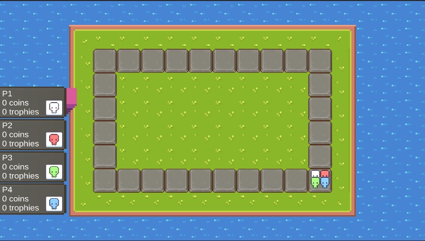
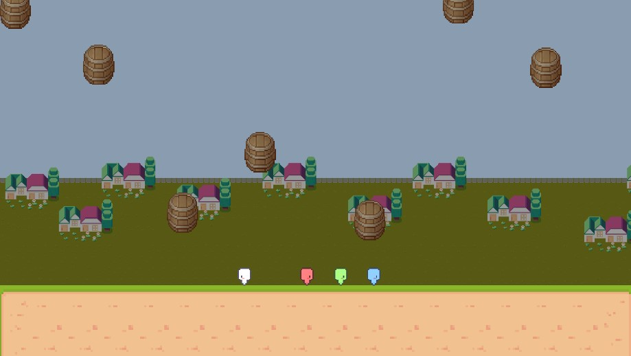
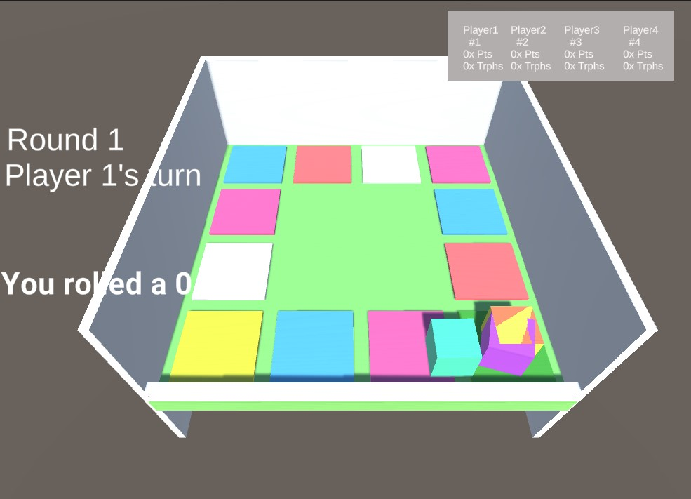

# Unity-Board-Game

Hi there! Thanks for checking out my game. 

## What is this?

My game is based off of the video game, Mario Party. It's basically a board game where players roll dice to move on the gameboard and after each round, the players play a minigame. This repeats for however many specified amount of rounds. The goal of the game is to collect coins and trade them in for trophies which are more valuable than coins, but harder to get. To trade coins in for trophies, a player must pass over or land on a "trophy tile" where they can purchase a trophy for 10 coins.

## Why this?

This is my first game idea that I'm trying to create and I wanted something simple, but also something that I enjoy and want to program. I've always had fun playing Mario Party with my friends, so I decided to go with my own version of Mario Party. 

Mario Party is also filled with minigames, so I thought that I will be able to gain the most experience since I will have the chance to create multiple types of minigames rather than creating one game that has one focus or idea. 

## In the works

This is my 3rd iteration of the game. I scrapped the other two due to my ideas getting too complicated and wanting to simplify things. In my opinion, the best way to learn is through testing things out yourself and actually working on something that provides results rather than blindly following tutorials. And that is exactly what I did with this project.

## 3rd iteration (Current)

**2D Unity format**

I decided to create my game in a 2D format so I can focus less on extra parts that the 3D format added and focus more on the programming aspect.

Coroutines. Thank goodness I learned about coroutines since they saved me from countless boolean condition checks. I programmed my 3rd iteration somewhat similarly to my 2nd iteration, but since I am using a 2D format I am able to base my tile checks through the script instead of relying on onCollision checks. This went a lot more smoothly since I prefer and have much more trust in my own code. 

### Ideas that were implemented (Light summary):

- Players (Colored sprites) that move from tile to tile
  - Movement system for minigame
- Turn system using coroutines
- Different tile types indicated by icons that are invoked when the player is on their endTile or if they pass a trophy tile. 
- Dice rolling 
  - Runs an animation and stops when player presses the spacebar
    - Grabs the name of the animation to find the number the dice rolled
- UI for player stats and a indicator that signifies the current player's turn
- Save/Load system for player data when loading in and out of scenes (Since scene data resets) using a static string variable
- Minigame

I completed the gameboard and was able to create my first minigame (Barrel Barrage) which is basically a dodge the falling blocks survival game where the last player standing wins. 

## 2nd iteration

**3D Unity format**

Although I am fluent in a few languages and C# is quite similar to Java, I wasn't fluent enough in Unity to pull off something as complicated as procedural generation.

This iteration I created a simple 12 tile circular looping board in a 4x4 format. 

### Ideas that were implemented (Light summary):
- Players (Cubes with different colors) that move from tile to tile
- Turn system, each turn goes through the player rolling, player moving, event running, then next player
- Different tile types indicated by color that invoked events when a player lands on it such as a (+) Coin Tile which adds 3 coins to the player who landed on it or a (-) Coin Tile which subtracts 3 coins.
- Dice rolling using Unity Physics and checking the side it lands on when the dice comes to a complete stop
  - Somewhat problematic since the dice roll was determined purely by the physics of the dice spin
- Simple UI displaying the current round, current player's turn, and the dice roll they rolled
- Player stat windows which provided players information about their current coins, trophies, and placements
  - Added a sorting system where it always brought the player with the most points to the front of the ordering list
    - Points were calculated by number of trophies, then number of coins

### Problems that led me to move to the 3rd iteration
- Relying on physics for dice roll
- Tons of boolean condition checks 
- When passing/landing on a trophy tile, the game would freeze because it would get stuck in a while loop. 

This is when I discovered coroutines which would allow the program to wait for a block of code to execute, then once executed it continues. This is perfect for me since I'm creating a strict turn-based board game (Not including future minigames). Coroutines would alow me to split up the players rolling, moving, and event execution into steps that are executed in a specified order. 

Since this was before I started using Github for version control (I was using Unity Collaborate/PlasticSCM), you can check out the commits for my 2nd iteration [here](https://docs.google.com/spreadsheets/d/1cn0DWHTvo3dd97a4EJ4dYoG9YeD8FlaakJX0QdDfZH0/edit?usp=sharing).

## 1st iteration

**3D Unity format**

I wanted to create a sort of endless gameboard that was randomly generated in tiles and the direction the tiles generated. At first I thought of the generation per singular tile and later I tried creating pre-made 2x2 patterns (L shaped or | shaped) that were randomly chosen to create a gameboard. My algorithm kept leading the tiles to generate into a dead end which would ultimately produce errors and freeze the game.

This led to my realization that procedural generation is complicated and since this is my first game I should probably start things off simpler. 
